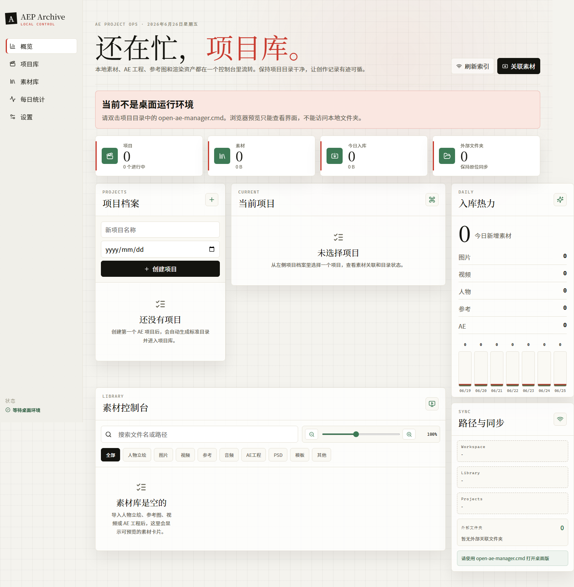

# AE Workbench

[](https://github.com/Saidyo/ae-workbench/actions/workflows/ci.yml)
[](LICENSE)

AE Workbench is a local desktop workstation for After Effects creators. It helps manage AE project folders, reference assets, images, videos, audio, PSD files, templates, delivery files, and Eagle library metadata in one visual workspace.

The app is built for local-first creative work. It indexes file paths and metadata, but it does not upload your assets or move your original Eagle files.



## Features

- Create and organize AE project folders.
- Index local assets from `Library/`, `Projects/`, and linked external folders.
- Preview images and videos directly in the asset library.
- Associate files and folders with specific AE projects.
- Import files into the current project with type-based folder mapping.
- Track daily asset counts and recent import trends.
- Sync Eagle metadata through the Eagle local API or a selected `.library` folder.
- Keep Eagle sync read-only: no write-back, moving, deleting, or copying Eagle originals.

## Tech Stack

| Layer | Stack |
| --- | --- |
| Desktop | Electron |
| UI | React + TypeScript |
| Build | Vite |
| Local data | JSON file store |
| File watching | chokidar |
| Icon system | lucide-react |

## Requirements

- Windows
- Node.js LTS
- npm
- Eagle, optional, if you want Eagle sync

## Quick Start

Clone the repository:

```powershell
git clone https://github.com/Saidyo/ae-workbench.git
cd ae-workbench
```

Install dependencies:

```powershell
npm install
```

Run in development mode:

```powershell
npm run dev
```

Build the desktop app:

```powershell
npm run build
```

## One-Click Start On Windows

For daily local use, double-click:

```text
一键打开AE Workbench.cmd
```

or:

```text
open-ae-workbench.cmd
```

For first-time deployment on another Windows machine, double-click:

```text
一键部署并打开AE Workbench.cmd
```

The deployment script checks Node.js/npm, installs dependencies, creates runtime folders, builds the app, checks the Eagle local API, and opens AE Workbench.

## Eagle Connection

AE Workbench supports two Eagle connection paths:

- Eagle local API: `http://127.0.0.1:41595`
- Manual `.library` folder selection from Settings

Eagle sync is read-only. AE Workbench does not modify, delete, move, or copy Eagle originals.

## Local Runtime Folders

These folders are generated locally and intentionally ignored by Git:

```text
Library/
Projects/
Cache/
data/
dist/
dist-electron/
node_modules/
```

## Scripts

| Command | Description |
| --- | --- |
| `npm run dev` | Start Vite and Electron for development |
| `npm run build` | Type-check Electron files and build the renderer |
| `npm run typecheck` | Run TypeScript checks without emitting files |

## Documentation

- [User Guide](docs/USER_GUIDE.md)
- [UI Refactor Workflow](docs/AE_UI_REFACTOR_WORKFLOW.md)
- [Product Notes](PRODUCT.md)
- [Functional Design](AE%20Workbench_%E5%8A%9F%E8%83%BD%E8%AE%BE%E8%AE%A1.md)

## Privacy

AE Workbench is designed as a local-first desktop tool. It stores project and asset indexes on your machine. The app does not provide a cloud upload service and does not send your local assets to a remote server.

## License

MIT License. See [LICENSE](LICENSE).
